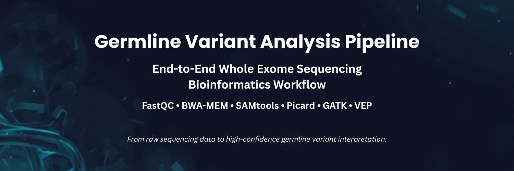
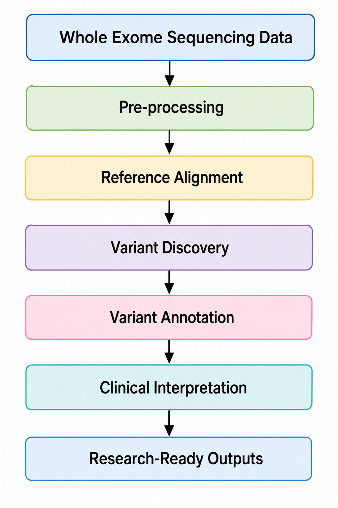
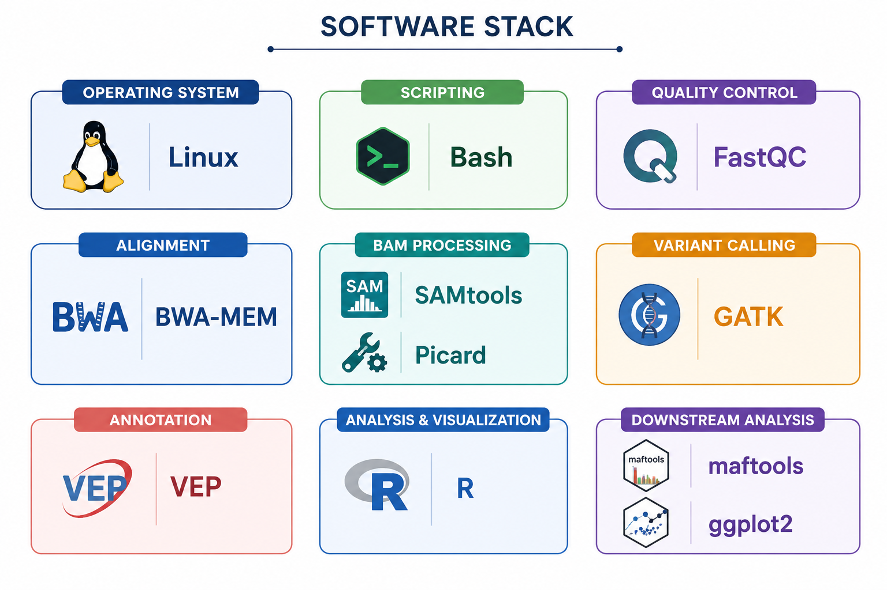
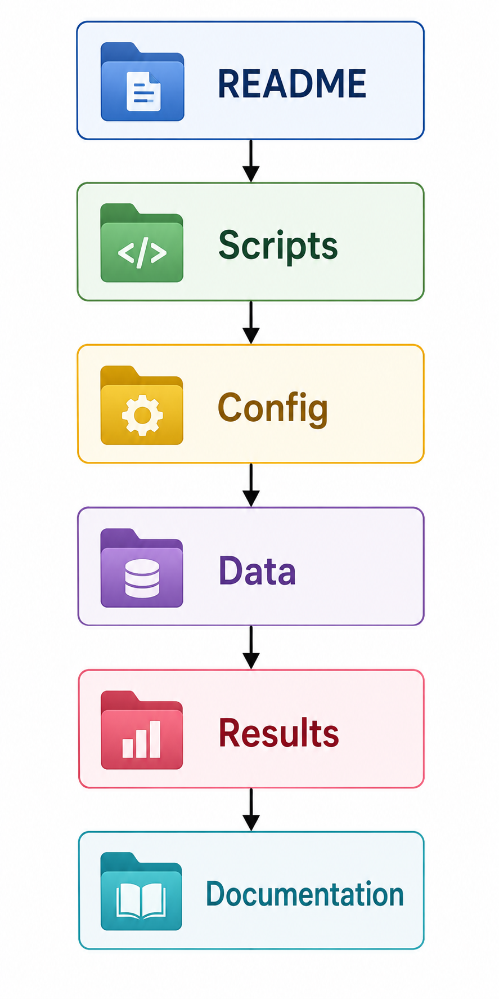

<p align="center">
  
</p>

<h1 align="center">🧬 Germline Variant Analysis Pipeline</h1>

<h3 align="center">
End-to-End Whole Exome Sequencing Bioinformatics Workflow
</h3>

<p align="center">
A reproducible computational pipeline for germline variant discovery, functional annotation, and downstream interpretation using Whole Exome Sequencing (WES) data.
</p>

<p align="center">


</p>

---

# 📌 Overview

Whole Exome Sequencing (WES) has become one of the most widely used approaches for identifying germline genetic variants associated with inherited diseases and precision medicine applications.

This repository presents a **reproducible end-to-end bioinformatics workflow** for germline variant analysis, following widely adopted best practices for sequence quality assessment, read alignment, post-alignment processing, variant discovery, filtering, annotation, and downstream variant prioritization.

The workflow is designed to be modular, reproducible, and easy to adapt for research and educational applications involving high-throughput sequencing data.

---

# 🎯 Project Objectives

This project aims to:

- Develop a reproducible Whole Exome Sequencing (WES) analysis pipeline.
- Perform standardized quality assessment of raw sequencing reads.
- Align sequencing reads to the human reference genome.
- Execute post-alignment processing following GATK Best Practices.
- Detect high-confidence germline variants.
- Perform functional annotation of genomic variants.
- Prioritize candidate variants for downstream interpretation.
- Demonstrate reproducible bioinformatics workflow development using Linux and Bash.

---

# ✨ Features

- ✅ End-to-End Whole Exome Sequencing Pipeline
- ✅ Modular Linux-based Workflow
- ✅ Automated Quality Control
- ✅ High-Performance Read Alignment
- ✅ GATK Best Practices Pipeline
- ✅ Germline Variant Discovery
- ✅ Functional Variant Annotation
- ✅ Downstream Variant Prioritization
- ✅ Reproducible Bioinformatics Workflow
- ✅ Research-Oriented Pipeline Design

---

# 🛠 Technology Stack

| Category | Technologies |
|-----------|--------------|
| **Operating System** | Linux |
| **Programming & Scripting** | Bash, R |
| **Quality Control** | FastQC |
| **Read Alignment** | BWA-MEM |
| **BAM Processing** | SAMtools, Picard |
| **Variant Calling** | GATK HaplotypeCaller |
| **Variant Annotation** | Variant Effect Predictor (VEP) |
| **Downstream Analysis** | R, maftools, ggplot2 |

---

# 🚀 Pipeline Highlights

- 🧬 Whole Exome Sequencing (WES) Workflow
- ⚡ GATK Best Practices Implementation
- 📊 Functional Variant Annotation
- 🖥 Linux-Based Bioinformatics Pipeline
- 📁 Modular Shell Script Architecture
- 🔬 Research-Oriented Computational Workflow
- 📈 Downstream Statistical Analysis
- 🔄 Reproducible Pipeline Design

---

# 📖 Bioinformatics Workflow

<p align="center">

</p>

The workflow follows a standardized computational strategy for processing Whole Exome Sequencing data, beginning with raw sequencing reads and progressing through quality assessment, alignment, variant discovery, annotation, and downstream statistical analysis.

---

# 🏗 Pipeline Architecture

<p align="center">

</p>

The pipeline follows a modular architecture that separates data preprocessing, variant discovery, annotation, and downstream interpretation into independent stages. This modular design improves reproducibility, simplifies maintenance, and allows individual components to be replaced or extended as new tools become available.

---

# 💻 Bioinformatics Software Stack

<p align="center">

</p>

The pipeline integrates widely adopted open-source bioinformatics software for each stage of Whole Exome Sequencing analysis.

| Category | Tool | Purpose |
|-----------|------|---------|
| Operating System | Linux | Pipeline execution environment |
| Scripting | Bash | Workflow automation |
| Quality Control | FastQC | Assess sequencing read quality |
| Alignment | BWA-MEM | Align sequencing reads to the reference genome |
| BAM Processing | SAMtools | Sorting, indexing, BAM manipulation |
| BAM Processing | Picard | Duplicate marking and alignment metrics |
| Variant Calling | GATK HaplotypeCaller | Germline variant discovery |
| Annotation | Variant Effect Predictor (VEP) | Functional variant annotation |
| Statistical Analysis | R | Downstream data analysis |
| Variant Exploration | maftools | Variant summarization and visualization |
| Visualization | ggplot2 | Publication-quality graphics |

---

# 📂 Repository Organization

<p align="center">

</p>

The repository is organized to separate workflow scripts, configuration files, documentation, and generated outputs, making the pipeline easy to navigate and extend.

---

# 🔬 Pipeline Components

The workflow is divided into modular stages, each responsible for a specific part of the germline variant analysis process.

---

## 1️⃣ Quality Control

### Objective

Assess the quality of raw sequencing reads before downstream analysis.

### Major Tasks

- Evaluate sequencing quality
- Examine GC-content distribution
- Identify adapter contamination
- Assess sequence duplication
- Generate quality reports

### Software

- FastQC

---

## 2️⃣ Read Alignment

### Objective

Align sequencing reads to the human reference genome.

### Major Tasks

- Reference genome indexing
- Read mapping
- Generate SAM/BAM files
- Alignment statistics

### Software

- BWA-MEM
- SAMtools

---

## 3️⃣ Post-Alignment Processing

### Objective

Prepare aligned sequencing data for accurate variant discovery.

### Major Tasks

- BAM sorting
- Duplicate marking
- BAM indexing
- Base Quality Score Recalibration (BQSR)

### Software

- Picard
- SAMtools
- GATK

---

## 4️⃣ Germline Variant Calling

### Objective

Identify high-confidence germline variants from processed alignment files.

### Major Tasks

- Variant discovery
- Generate raw VCF files
- Joint genotyping (where applicable)

### Software

- GATK HaplotypeCaller

---

## 5️⃣ Variant Filtering

### Objective

Remove low-confidence variants and retain high-quality candidate variants.

### Major Tasks

- Quality-based filtering
- Depth filtering
- Confidence filtering
- Standard variant quality control

### Software

- GATK

---

## 6️⃣ Functional Annotation

### Objective

Predict the biological consequences of detected variants.

### Major Tasks

- Gene annotation
- Functional consequence prediction
- Variant effect annotation

### Software

- Variant Effect Predictor (VEP)

---

## 7️⃣ Downstream Statistical Analysis

### Objective

Summarize, prioritize, and visualize annotated variants.

### Major Tasks

- Variant summarization
- Exploratory analysis
- Statistical visualization
- Candidate variant prioritization

### Software

- R
- maftools
- ggplot2

---

# 📋 Pipeline Scripts

| Script | Description |
|---------|-------------|
| `germline_variant_pipeline.sh` | Performs read alignment, BAM processing, variant calling, filtering, and annotation |
| `merge_maf_files.R` | Imports and merges MAF files for downstream analyses |
| `average_depth_coverage.sh` | Calculates average sequencing depth from filtered VCF files |

---

# 📁 Repository Structure

```text
germline-variant-analysis-pipeline/
│
├── README.md
├── LICENSE
├── .gitignore
│
├── assets/
│   ├── banner.png
│   ├── workflow.png
│   ├── pipeline-overview.png
│   ├── software-stack.png
│   └── folder-structure.png
│
├── scripts/
    ├── README.md
    ├── Identifying_variants.sh
    ├── Extracting_data.R
    └── average_depth_coverage.sh
```

---

# 🚀 Workflow Scripts

The repository contains three primary scripts:

| Script | Purpose |
|---------|----------|
| Identifying_variants.sh | End-to-end germline variant analysis pipeline |
| Extracting_data.R | Import and merge MAF files for downstream analysis |
| average_depth_coverage.sh | Calculate sequencing depth statistics |

---

# 📦 Pipeline Outputs

The workflow generates multiple intermediate and final outputs throughout the analysis.

Typical outputs include:

- Quality Control Reports
- Sorted BAM Files
- Indexed BAM Files
- Duplicate Metrics
- Recalibrated BAM Files
- Raw Variant Call Files (VCF)
- Filtered Variant Files
- Annotated Variant Tables
- Candidate Variant Lists
- Summary Statistics

---

# 🔄 Reproducibility

The workflow has been designed to promote reproducible bioinformatics analyses through:

- Modular shell scripts
- Standardized directory organization
- Version-controlled source code
- Conda environment specification
- Consistent workflow execution
- Open-source software tools

---

# 📂 Data

Raw sequencing data and processed outputs are **not included** in this repository.

Users should provide their own sequencing datasets and reference genomes before executing the workflow.

The repository demonstrates the computational implementation of the pipeline rather than distributing sequencing data.

---

# 📚 References

## 📚 Software

This workflow utilizes widely adopted open-source bioinformatics software, including:

- FastQC
- BWA-MEM
- SAMtools
- Picard
- GATK
- Variant Effect Predictor (VEP)
- R
- maftools
- ggplot2

Please cite the respective software packages when using them in research.

---

# 🔒 Research Notice

> **Research Notice**

This repository contains the computational implementation of a germline variant analysis workflow developed for Whole Exome Sequencing (WES) data.

The associated research study is currently under peer review.

To preserve research confidentiality and comply with publication requirements, the following materials are intentionally excluded from this repository:

- Sequencing datasets
- Intermediate analysis outputs
- Variant call files
- Annotated variant tables
- Statistical analyses
- Figures
- Manuscript results
- Study-specific findings

This repository is intended to demonstrate the engineering, reproducibility, and implementation of the computational pipeline.

---

# 🚀 Future Improvements

Planned enhancements include:

- Nextflow implementation
- Snakemake workflow
- Docker containerization
- GitHub Actions

---

# 📄 License

This project is licensed under the **MIT License**.

See the `LICENSE` file for additional details.

---

# 📖 Citation

If you find this repository useful, please consider citing the repository after the associated research work has been published.

Citation information will be updated following publication.

---

# 👨‍💻 Author

## Abhimanyu Mandal

Computational Biologist | Bioinformatics Researcher | Healthcare Data Scientist

🌐 **Portfolio**

https://abhimanyumandal.github.io/Personal-Portfolio/

💼 **LinkedIn**

https://www.linkedin.com/in/abhimanyu-mandal/

📧 **Email**

abhimanyumandal0810@gmail.com

---

<p align="center">

### ⭐ If you found this repository useful, please consider giving it a star!

</p>

<p align="center">

**Building reproducible bioinformatics pipelines for scalable genomic data analysis.**

</p>
